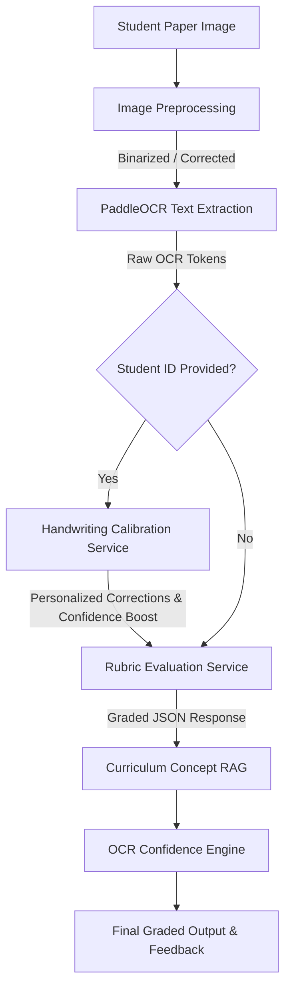

# 📝 Paper Checker: Intelligent Answer Sheet Evaluator

Paper Checker is an automated grading and evaluation assistant designed to assess handwritten student answer sheets. The system utilizes advanced image preprocessing, OCR (PaddleOCR), student-specific handwriting calibration, curriculum-specific retrieval-augmented generation (RAG), and grading rubrics to evaluate answers, assign scores, and deliver precise feedback.

---

## 🏗️ System Architecture

The evaluation pipeline processes an uploaded image linearly through the following stages:



1. **Image Preprocessing**: Corrects image alignment, performs grayscale conversion, thresholding, and size normalization using OpenCV.
2. **OCR Engine**: Extracts lines and tokens using PaddleOCR, computing positional bounding boxes and confidence metrics.
3. **Handwriting Calibration**: Matches the student's unique character slant, character size, and word spacing metrics. Performs character-level sequence alignment against a known text template to identify personal character confusion patterns (e.g., `l` misrecognized as `i`) and corrects them.
4. **Rubric Evaluation**: Scores the student's answers based on subject-specific criteria and generates custom constructive feedback.
5. **RAG Concept Retrieval**: Connects extracted terminology to curriculum concepts.
6. **Confidence Engine**: Calculates overall prediction confidence based on character and line metrics, boosted dynamically by handwriting calibration success.

---

## 🚀 Quick Start & Installation

### Backend Setup (Python)

1. **Verify Python Environment**:
   Ensure Python 3.10+ is installed.

2. **Initialize and Activate Virtual Environment**:
   ```bash
   python -m venv .venv
   source .venv/bin/activate  # On Windows, use `.venv\Scripts\activate`
   ```

3. **Install Dependencies**:
   ```bash
   pip install -r requirements.txt
   ```

4. **Launch the FastAPI Server**:
   ```bash
   uvicorn backend.app:app --host 127.0.0.1 --port 8000
   ```
   > [!NOTE]
   > The API docs will be available at [http://127.0.0.1:8000/docs](http://127.0.0.1:8000/docs) (Swagger UI).

### Frontend Setup (Vite + React)

1. **Install Node.js Packages**:
   Make sure you are in the root directory.
   ```bash
   npm install
   ```

2. **Launch the Frontend Server**:
   ```bash
   npm run dev
   ```
   This will boot up the Vite server. If port `5173` is in use, it will automatically serve at:
   [http://localhost:5174](http://localhost:5174) or similar.

---

## 🧪 How to Test It All

### 1. Automated Test Suite (Backend)

Run the Python test suite to verify module mechanics, API endpoints, preprocessing, and calibration:
```bash
.venv/bin/pytest -v
```

> [!TIP]
> The tests run inside the pytest environment and verify both the underlying services and API routers under `/tests/`.

### 2. Manual Testing (The Developer Lab UI)

Open [http://localhost:5174/](http://localhost:5174) in your browser and click on the **Developer Lab** button:

#### Step A: Handwriting Calibration (Optional but Recommended)
1. In the sidebar under **Handwriting Calibration**, enter a unique **Student ID** (e.g., `student_99`).
2. Click **Calibrate Handwriting**.
3. Upload a sample handwriting page (you can use `tests/handwritten.jpeg` or a custom calibration sheet).
4. Review the **Calibration Reference Text** to ensure it matches what was written.
5. Click **Run Calibration**. The system will scan the page, calculate physical metrics (slant angle, spacing, sizes), and register common character substitutions.
6. Click **Close** to return. You will see a green badge: `✓ Calibrated Profile Loaded`.

#### Step B: Student Answer Sheet Evaluation
1. Click the main upload zone to upload a student answer sheet (e.g., `tests/sample.jpeg`).
2. Verify that the file card says `Ready for Evaluation`.
3. Enter the same **Student ID** (`student_99`) in the sidebar field if not already present.
4. Click **Run Evaluation Pipeline**.
5. Once complete, inspect the tabs:
   * **IMAGE**: View the preprocessed static image output.
   * **OCR**: Compare **Raw OCR Text** side-by-side with the calibrated **Corrected OCR (Calibration)**. Notice how student-specific writing quirks are automatically fixed!
   * **EVALUATION**: View retrieved curriculum concepts (RAG), the rubric utilized, score cards, evaluation details, and actionable feedback.

---

## 📁 Directory Structure

```
.
├── backend/
│   ├── api/                 # FastAPI Router Endpoints (Health, Upload, Evaluate, Calibrate)
│   ├── engine/              # Main Orchestrator (Pipeline.py)
│   ├── schemas/             # Pydantic Request & Response Validation Models
│   ├── services/
│   │   ├── calibration/     # Handwriting Profile Calibration & Correctors
│   │   ├── confidence/      # OCR Confidence Grading
│   │   ├── evaluation/      # Rubric Matching Engine
│   │   ├── ocr/             # PaddleOCR Integration
│   │   ├── preprocessing/   # Image Binarization & Skew Correction
│   │   └── rag/             # Curriculum Database Concept Mapper
│   └── uploads/             # Stores uploaded files and student JSON profiles
├── src/                     # React Frontend Source Code
├── tests/                   # Python Pytest Test Cases & Mock Media Files
├── package.json             # Frontend Dependency Configuration
└── vite.config.js           # Vite Server Optimization Options
```
