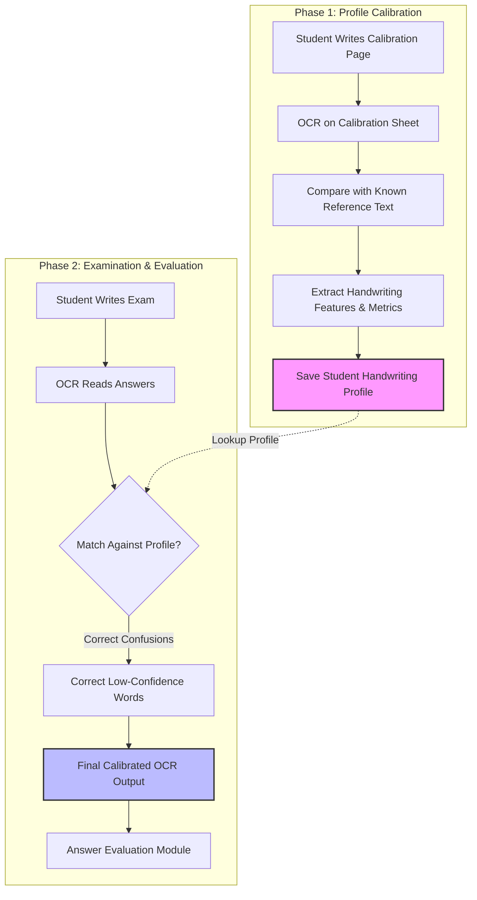

# Calibration Service Module

This directory contains the documentation and core concepts for the **Calibration Module** of the Paper Checker application. The Calibration Service is responsible for building and utilizing personalized handwriting profiles to correct character recognition errors and improve OCR accuracy.

---

## 📌 What is Calibration?

**Calibration** in the proposed system is the process of creating a personalized handwriting profile for each student using a predefined calibration sheet containing known text. 

Instead of relying solely on a generic OCR model, the system analyzes the student's unique writing style, learning how they form individual characters, space words, slant letters, and join strokes. During examination, this calibration profile is used to refine low-confidence OCR predictions, resulting in more accurate text extraction and improving the reliability of automated answer evaluation.

---

## ❓ Why is it Needed?

Generic OCR engines (like PaddleOCR, Tesseract, etc.) are trained on diverse datasets but often struggle with the extreme variability of human handwriting:
* **Character Ambiguity**: Different students write the same character in different ways. For example:
  * **Student A** writes: `a`
  * **Student B** writes: `ɑ`
  * **Student C** writes: `o`
* **Unclear Handwriting**: A generic model may confuse these variations, especially if letters are written quickly or joined.
* **Error Correction**: Rather than guessing, the system uses the student's *own* writing history to resolve ambiguous characters.

---

## 🛠️ The Calibration Process

### Step 1: Calibration Sheet
Before using the system, the student writes on a predefined calibration page containing:
* **All alphabets** (uppercase and lowercase)
* **Numbers** (`0-9`)
* **Common punctuation**
* **Subject-specific vocabulary** (e.g., *Current, Voltage, Resistance, Electricity, Circuit, Battery, Electron, Potential Difference*)

#### Sample Calibration Text
> **The quick brown fox jumps over the lazy dog.**  
> **ABCDEFGHIJKLMNOPQRSTUVWXYZ**  
> **abcdefghijklmnopqrstuvwxyz**  
> **0123456789**  
> **Current, Voltage, Resistance, Electricity, Circuit, Battery, Electron, Potential Difference**

### Step 2: OCR Processing & Error Discovery
The calibration sheet is scanned and processed by the OCR engine. Since the expected reference text is already known, the system performs a sequence alignment between the expected text and the raw OCR output to identify systematic errors.

| Expected Text | OCR Output | Discovered Error / Mapping |
| :--- | :--- | :--- |
| `Resistance` | `Reslstance` | `i` is misrecognized as `l` |
| `Current` | `Currcnt` | `e` is misrecognized as `c` |

### Step 3: Building the Handwriting Profile
The system extracts physical and recognition metrics to construct a **Handwriting Profile** (`HandwritingProfile` model), storing:
* **Student ID**: `S1023`
* **Physical Attributes**:
  * **Average Character Height**: `18 px`
  * **Average Character Width**: `10 px`
  * **Word Spacing**: `12 px`
  * **Line Spacing**: `32 px`
  * **Slant Angle**: `9°`
* **Common Confusions / Substitution Dictionary**:
  * `i ↔ l`
  * `o ↔ a`
  * `u ↔ n`
  * `e ↔ c`

### Step 4: Examination Decoding & Correction
During an exam, if a student writes a word that results in a low-confidence OCR token, the system references their profile.

#### Correction Example 1:
1. Student writes: `Resistance`
2. Raw OCR reads: `Reslstance` (low confidence)
3. Calibration profile indicates: **Student S1023's `i` looks like `l`.**
4. Correction applied: `Reslstance` ➔ `Resistance`

#### Correction Example 2 (Confidence Boost):
* **OCR Raw Output**: `Potentlal Difference` (Generic OCR confidence: **63%**)
* **Profile Check**: Profile shows the student always writes `i` like `l`.
* **Decoded Output**: `Potential Difference` (Updated confidence: **95%**)

---

## 🔄 Calibration Workflow

The following diagram illustrates the linear integration of the calibration module into the answer sheet processing lifecycle:

---

## 🚀 Key Advantages

1. **Personalized Recognition**: Adapts dynamically to individual writing quirks rather than relying on a static, one-size-fits-all model.
2. **Higher OCR Accuracy**: Drastically reduces character substitution errors (e.g., `l` for `i`, `c` for `e`).
3. **Intelligent Confidence Boosting**: Validates low-confidence predictions using known historical writing patterns.
4. **Improved Grading Quality**: Standardizes text input, preventing downstream AI/evaluation modules from failing due to spelling distortions.
5. **Reduced Manual Verification**: Lowers the overhead of manual teacher reviews by resolving ambiguities programmatically.

---

> [!NOTE]
> The Calibration Module is designed to work in conjunction with the Preprocessing and OCR services. It intercepts the OCR output post-extraction and pre-evaluation.
