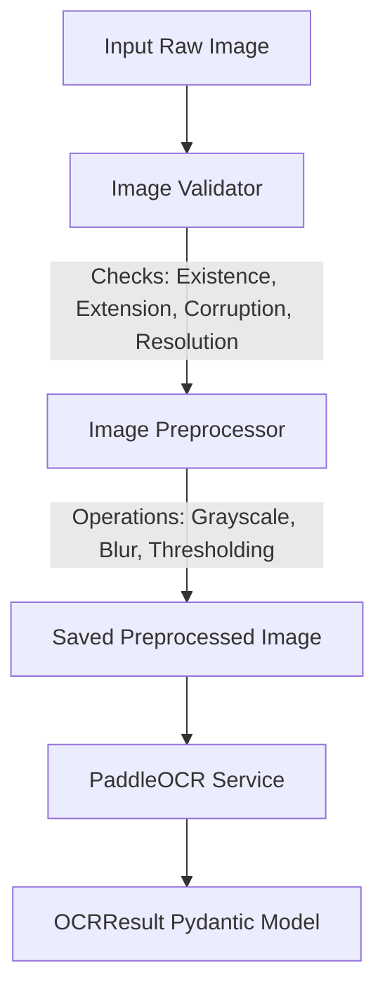

# OCR Service Module

This directory contains the Optical Character Recognition (OCR) module for the Paper Checker application. It provides an interface and implementation for extracting text from document images.

## Purpose

The OCR service is responsible for:
1. Loading the OCR engine/model (PaddleOCR) once and maintaining it in memory.
2. Performing text extraction from preprocessed document images.
3. Structuring raw OCR output into clean, typed, and well-structured schemas for downstream services (such as evaluation and grading).

This service strictly does **NOT** handle image preprocessing, calibration, grading logic, or external RAG integrations.

---

## Pipeline

The image analysis workflow follows a linear pipeline:



1. **Validation**: Check that the file exists, has a supported format, is not corrupted, and meets minimum resolution requirements.
2. **Preprocessing**: Convert to grayscale, apply blur, and optional thresholding to optimize for character recognition, then save to a temporary output folder.
3. **Extraction**: Run PaddleOCR on the preprocessed image path.
4. **Parsing**: Map the engine-specific output into standard `OCRResult` and `OCRLine` objects.

---

## Input

The service accepts a local file path to the preprocessed image:

- **Type**: `str` (or `os.PathLike`)
- **Supported Formats**: `.jpg`, `.jpeg`, `.png`
- **Minimum Resolution**: 500x500 pixels

---

## Output

The service returns an `OCRResult` object (a Pydantic model).

### Schemas

#### `OCRResult`
| Field | Type | Description |
|---|---|---|
| `text` | `str` | Complete reconstructed text, with lines joined by newlines (`\n`). |
| `lines` | `list[OCRLine]` | List of individual detected text lines with position and confidence values. |
| `average_confidence` | `float` | Mean confidence value (0.0 to 1.0) of all detected text lines. |

#### `OCRLine`
| Field | Type | Description |
|---|---|---|
| `text` | `str` | The extracted text string for this specific line. |
| `confidence` | `float` | Confidence score (0.0 to 1.0) of the detection. |
| `box` | `list` | A list of 4 coordinates `[[x1, y1], [x2, y2], [x3, y3], [x4, y4]]` representing the bounding box. |

---

## Example Usage

Here is a complete example demonstrating how to initialize the preprocessing service, run it on a raw image, pass the result to the OCR service, and process the output.

```python
import logging
from backend.services.preprocessing.image_processor import ImagePreprocessor
from backend.services.ocr.paddle_service import PaddleOCRService

# Configure logger to see steps and validation output
logging.basicConfig(level=logging.INFO)

def main():
    # 1. Initialize the Preprocessing and OCR services
    preprocessor = ImagePreprocessor()
    ocr_service = PaddleOCRService(
        language="en", 
        use_angle_cls=True, 
        use_gpu=False
    )

    # 2. Run Image Preprocessing
    # This automatically runs validations (existence, format, resolution, etc.)
    image_path = "tests/sample.jpeg"
    processed_image = preprocessor.process(image_path)
    
    print(f"Processed image successfully and saved to: {processed_image.processed_path}")

    # 3. Extract text using OCR Service
    ocr_result = ocr_service.extract_text(processed_image.processed_path)

    # 4. Access individual components
    print("\n--- Extracted Text ---")
    print(ocr_result.text)

    print(f"\nAverage Confidence: {ocr_result.average_confidence:.2%}")
    print(f"Total Lines Detected: {len(ocr_result.lines)}")

    # 5. Iterating over line results
    print("\n--- Bounding Boxes ---")
    for i, line in enumerate(ocr_result.lines[:3]):  # print first 3 lines
        print(f"Line {i}: '{line.text}' (Conf: {line.confidence:.2%})")
        print(f"  Box: {line.box}")

if __name__ == "__main__":
    main()
```
